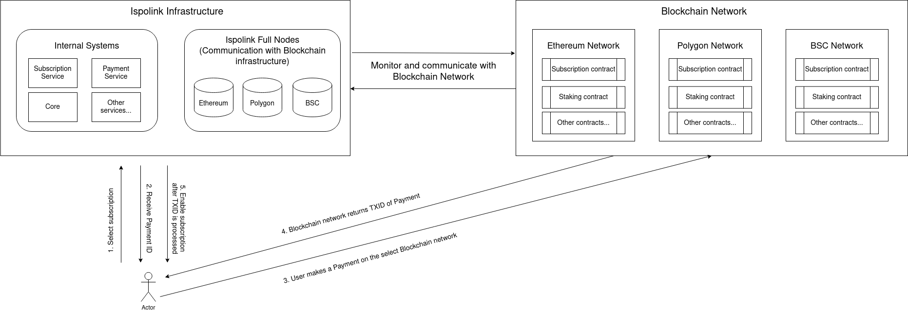
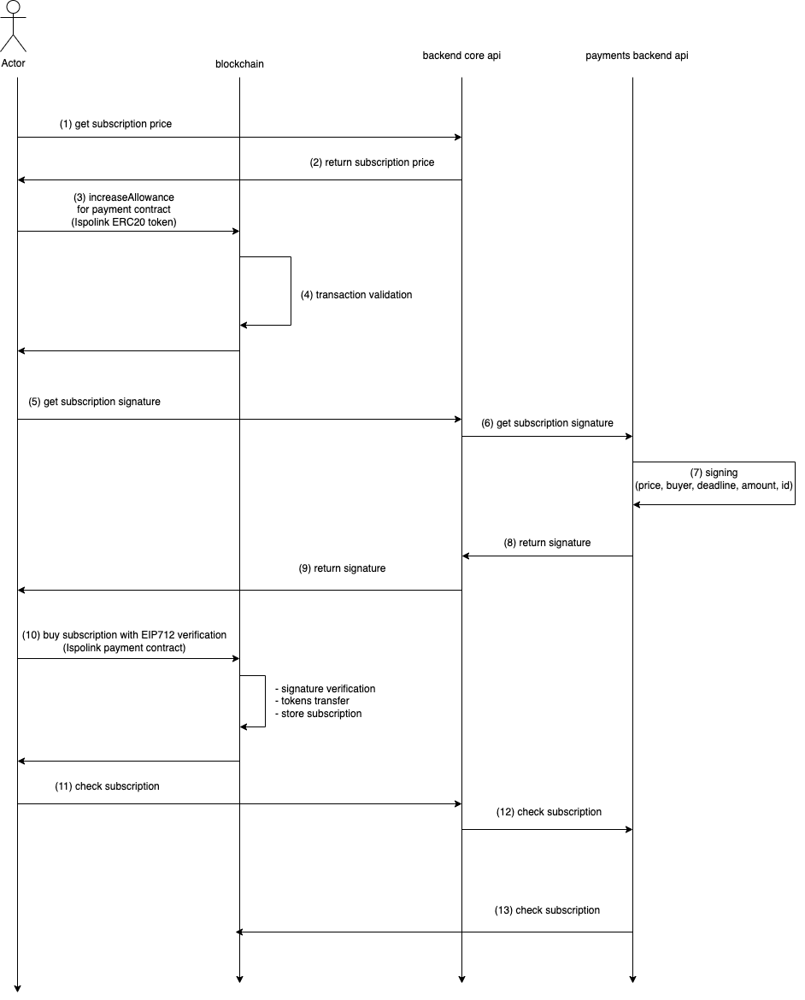

# Decentralized Payment Infrastructure

This repository contains the source code for Ispolink's payment infrastructure - an interoperable in-Dapp subscription system.

## Overview

Users on the Ispolink platform are able to purchase subscriptions to unlock premium platform features in fully decentralized manner. The smart contract accepts payments in the native [ERC-20](https://eips.ethereum.org/EIPS/eip-20) token of the Ispolink platform - ISP.

Transactions to the smart contract contain the unique subscription IDs which can be publicly verified on-chain.

## Supported chains

The payment infrastructure is deployed on the following EVM chains:

- Ethereum
- BNB Smart Chain (BSC)
- Polygon

## Payment Diagrams Workflow

The following diagrams illustrate the user interaction with the payment system:

## Technical details

Supported features of the payments system:

- Blockchain transaction deadline - user must send the specified amount of ISP tokens before the payment expires
- SignTypedData V4 - it follows the [EIP-712](https://eips.ethereum.org/EIPS/eip-712) standard to allow requesting the user sign a struct that can be verified on-chain
- The smart contract is covered with unit tests

## Development

This Hardhat project contains a Solidity smart contract `PaymentContract` which enables subscriptions using `ERC20` tokens. The smart contract also includes a `PaymentVerifier` contract that verifies payment signatures.

### Installation and Setup

- Install the required dependencies using the command: `npm install`
- Compile the smart contract using the command: `npx hardhat compile`
- Run the tests using the command: `npx hardhat test`

### PaymentVerifier

The `PaymentVerifier` contract verifies payment signatures using the `EIP712` standard. The contract inherits from the `EIP712` and `Ownable` contracts from the OpenZeppelin library. 
The contract constructor takes three parameters: `name`, `version`, and `signer`. The `name` and `version` parameters are used to create the `EIP712` domain separator. 
The `signer` parameter is the address of the signer used to verify the signature.

The contract includes a private constant `_TYPEHASH` which is the type hash of the payment struct used in the signature. The contract includes an internal view 
function `verifyPaymentSignature` which verifies the payment signature using the `EIP712` standard. The function takes four parameters: `signature`, `subscriptionId`, `amount`, and `deadline`. 
If the signature is not valid, the function reverts with an error message.

### PaymentContract

The `PaymentContract` contract enables subscriptions using `ERC20` tokens. The contract inherits from the `PaymentVerifier` contract. The contract constructor takes three parameters: `token`,  
`name` and `version`. The `token` parameter is the address of the `ERC20` token used for payments. The `name` and `version` parameters are used in the `PaymentVerifier` for domain separator.

The private mapping `subscriptions` stores subscription information which the following fields: `buyer`, `timestamp`, `amount`, and `currency`.
The function `withdrawAll`  allows the contract owner to withdraw all tokens from the contract and transfer them to a specified address. 
Also by `setTokenAddress` function is allowed the contract owner to change the address of the `ERC20` token used for payments.

The contract includes a createSubscription function which creates a new subscription and stores the subscription information in the subscriptions mapping. The function takes four parameters: `signature`, 
`subscriptionId`, `amount`, and `deadline`. The function verifies the payment signature using the `verifyPaymentSignature` function from the `PaymentVerifier` contract. If the signature is valid, 
the function creates a new subscription and emits a `SubscriptionPaid` event.

By `getSubscription` function is possible to retrieve the subscription information for a specified subscription ID. The contract also includes `getTokenAddress` function which returns the
address of the `ERC20` currency used for the subscription payment.

### Deployment

The smart contract can be deployed to a test network or mainnet using Hardhat. Please refer to the Hardhat documentation for more information on deployment.

The contract for the payment system - version v1.0.0, compiled with solc v0.8.9 is deployed here:

- ETH Mainnet: https://etherscan.io/address/0x3C9136a716e0eaFA74a61ABdDac076811860874C
- BSC Mainnet: https://bscscan.com/address/0x3C9136a716e0eaFA74a61ABdDac076811860874C
- Polygon Mainnet: https://polygonscan.com/address/0x3C9136a716e0eaFA74a61ABdDac076811860874C
